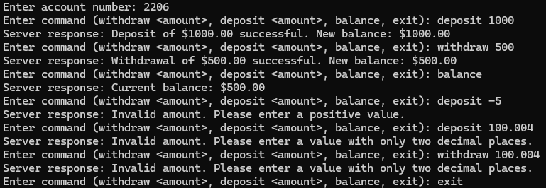

# Producer/Consumer Bank Account
The implementation of bank account using producer/consumer allows for multiple
clients to work and connect to the same server for editing and having banking
transaction. This also allows the same account to be edited with no issues. To
do this, semaphores, mutexes, and threads were used. The server has its own 
thread for each client that is attached. The semaphores and mutex allow for
only one to make changes at a time. By using epoll, it allows one thread wait
for new connections or ready sockets. It wakes the socket only when there is
work to do.

## Basic Info
To allow for the implementation works, whoever is running the server on their
computer or server side must create a balance.csv file. Also, by typing 'exit'
in the server terminal, it safely closes the server.

## Purpose
A multi-client TCP banking server that uses threads, a bounded transaction
queues, semaphores, and mutexes to safely coordinate work acroos multiple
clients while logging each transaction and updating balances on disk. Epoll is
used on the listening socket to efficiently accept new connections.

## Sample Input/Output/Usage
* First Input: Account number
* Any Input After First:
  * deposit (amount)
  * withdraw (amount)
  * balance
  * exit
* Output:
  * balance: Server response: Current balance: (balance)
  * deposit: Server response: Deposit of (amount) successful. New balance: (balance)
  * withdraw: Server response: Withdrawal of (amount) successful. New balance: (balance)
  * Too many decimals: Server response: Invalid amount. Please enter a value with only two decimal places.
  * Negative deposit: Invalid amount. Please enter a positive value.
* Example:
  * 

## Non Explored Aspect
Epoll is a Linux I/O event notification API that lets you register file descriptors
and get woken only when they're ready, scalling better than select/poll for many
sockets. In this program, epoll is creater on startup and the listening socket is
added; the server sits in epoll_wait, and when the listening socket becomes readable,
it accepts a new client.
